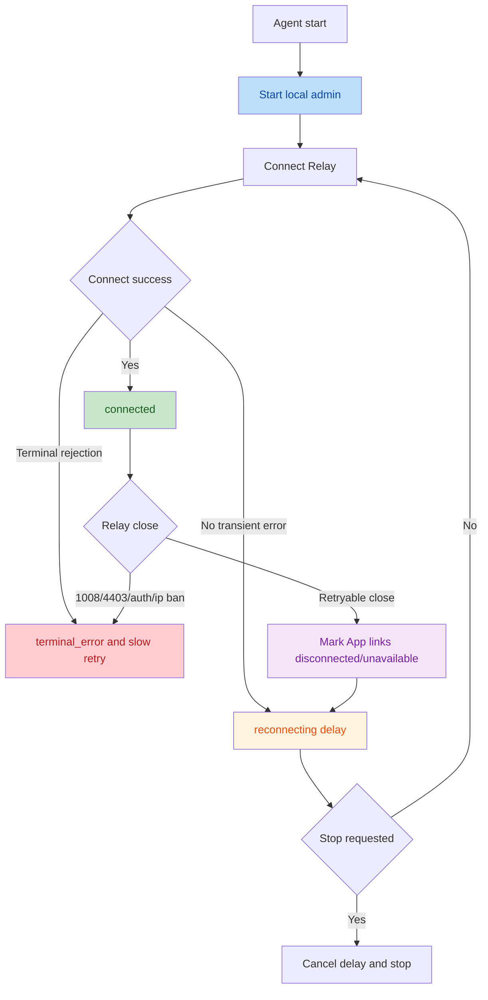
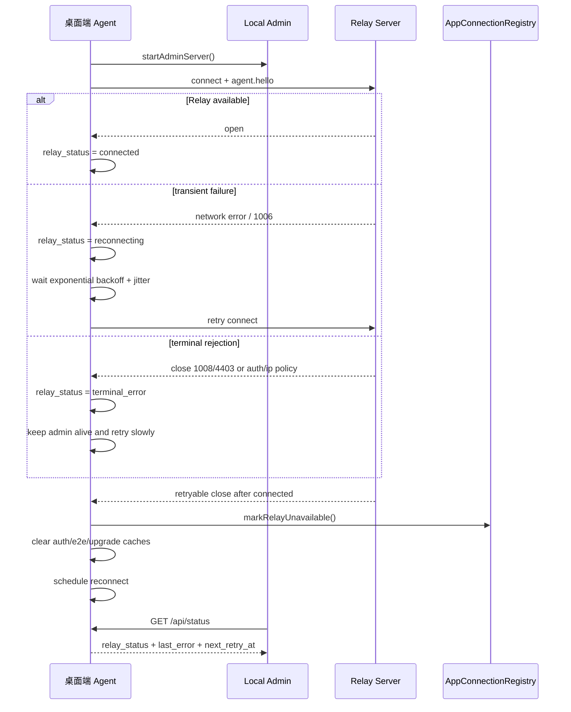

# App 安装与构建说明

关联文档：

- [engineering-requirements.md](./engineering-requirements.md)
- [project-directory-structure.md](./project-directory-structure.md)

## 目标

`app/` 优先交付安装到 Android 和 iOS 真机上的移动 App，同时提供一个保持同一技术栈的 Web 单页面程序。本工程采用 React Native CLI，移动端打包产物为 Android `APK` 和 iOS `IPA`；Web 端通过 `react-native-web` 构建静态 SPA，不另起一套 DOM UI。

支持两条安装路径：

- 本地 React Native CLI 运行：适合开发机调试。
- 原生工程构建：适合团队分发和真机安装。
- Web SPA 构建：适合浏览器入口，不支持扫码，使用手动、明文 URL 或加密分享 URL 配对。

## 包名配置

默认配置：

```text
iOS bundle id: com.omniwork.mobile
Android package: com.omniwork.mobile
```

可通过环境变量覆盖：

```text
OMNIWORK_IOS_BUNDLE_ID=com.company.omniwork
OMNIWORK_ANDROID_PACKAGE=com.company.omniwork
OMNIWORK_APP_VERSION=0.1.0
OMNIWORK_IOS_BUILD_NUMBER=1
OMNIWORK_ANDROID_VERSION_CODE=1
OMNIWORK_WEB_RELAY_URL=wss://your-domain.example/relay/ws/mobile
```

iOS Release 签名（CI 注入；本地冒烟可走 `pnpm app:build:ios:dev` 跳过签名）：

```text
OMNIWORK_IOS_DEVELOPMENT_TEAM=ABCDE12345
OMNIWORK_IOS_PROVISIONING_PROFILE=OmniWork Distribution
OMNIWORK_IOS_CODE_SIGN_STYLE=Manual
OMNIWORK_IOS_CODE_SIGN_IDENTITY=Apple Distribution
```

Android Release 签名（CI 注入；缺失任一变量会回退到 debug 签名并打印告警，不应分发）：

```text
OMNIWORK_RELEASE_KEYSTORE=/path/to/omniwork-release.keystore
OMNIWORK_RELEASE_KEYSTORE_PASSWORD=
OMNIWORK_RELEASE_KEY_ALIAS=omniwork-release
OMNIWORK_RELEASE_KEY_PASSWORD=
```

> [app/android/app/src/main/AndroidManifest.xml](../app/android/app/src/main/AndroidManifest.xml) 中
> `android:usesCleartextTraffic="true"`，目的是方便扫码连公网 IP 形态的 `ws://` Relay。
> 业务安全由 App-Agent E2E 加密承担；`wss://` 仍推荐用于降低网络侧元数据暴露，但不是业务安全边界。

示例文件：[app/.env.example](../app/.env.example)

## Android APK 安装

生成 APK：

```sh
pnpm app:build:android:apk
```

生成 AAB（Play Store / 公司 MDM 分发）：

```sh
pnpm app:build:android:aab
```

或在 app package 内执行：

```sh
pnpm --filter @omniwork/app build:android:apk
pnpm --filter @omniwork/app build:android:aab
```

产物：

- App 构建脚本会先运行 `pnpm --filter @omniwork/app generate:xterm-assets`，从已安装的 `@xterm/*` 与 CodeMirror 依赖生成 Native WebView 终端和编辑器本地资源；升级 xterm 或 CodeMirror 依赖后重新执行构建即可刷新资源。
- Gradle 会读取 `OMNIWORK_APP_VERSION` / `OMNIWORK_ANDROID_VERSION_CODE` / `OMNIWORK_ANDROID_PACKAGE` 环境变量注入 versionName / versionCode / applicationId。
- 当同时提供 `OMNIWORK_RELEASE_KEYSTORE`、`OMNIWORK_RELEASE_KEYSTORE_PASSWORD`、`OMNIWORK_RELEASE_KEY_ALIAS`、`OMNIWORK_RELEASE_KEY_PASSWORD` 时使用 release 签名；否则回退到 debug 签名（仅供 CI 冒烟产物，不可分发）。
- 默认 release 允许明文 `ws://` 流量（manifest 硬编码 `usesCleartextTraffic="true"`），方便扫码连公网 IP 形态的 Relay；业务消息必须通过 E2E 加密，不允许明文业务 fallback。

本地调试：

```sh
pnpm --filter @omniwork/app android
```

要求：

- 已安装 Android Studio。
- 已配置 Android SDK。
- 真机开启 USB 调试或有可用模拟器。

## iOS IPA 安装

生成已签名 Release IPA：

```sh
pnpm app:build:ios
```

或在 app package 内执行：

```sh
pnpm --filter @omniwork/app build:ios
```

该入口对应 `app/scripts/buildIosRelease.mjs`：会先 `pod install`，再调用 `react-native build-ios`，并校验 `OMNIWORK_IOS_DEVELOPMENT_TEAM`、`OMNIWORK_IOS_PROVISIONING_PROFILE` 必填，缺失时直接退出避免静默产出无签名 IPA。`OMNIWORK_IOS_CODE_SIGN_STYLE`（默认 `Manual`）、`OMNIWORK_IOS_CODE_SIGN_IDENTITY`（默认 `Apple Distribution`）、`OMNIWORK_IOS_BUNDLE_ID`、`OMNIWORK_APP_VERSION`、`OMNIWORK_IOS_BUILD_NUMBER` 会导出给 OmniWork App target 的 Xcode build settings，不作为全局 `xcodebuild` 覆盖传入，避免 Pods target 继承 App provisioning profile。

无签名冒烟构建（仅用于本地或 CI 编译可达性自检）：

```sh
pnpm app:build:ios:dev
```

产物：

- Release：Xcode archive 可导出可安装到 iOS 真机的 IPA，并已经过 CI 注入的签名身份签署。
- Dev：以 `CODE_SIGNING_ALLOWED=NO` 编译，仅产出未签名构件，不能用于真机分发或 TestFlight。

要求：

- Apple Developer Team。
- 已在 Xcode 中配置 signing、certificate 和 provisioning profile，并通过环境变量注入。
- 真机 UDID 需要加入 provisioning profile，或使用企业分发/TestFlight。

本地调试：

```sh
pnpm --filter @omniwork/app ios
```

要求：

- 电脑系统。
- Xcode。
- Apple 开发者账号。
- iPhone 连接到本机或有可用模拟器。

## React Native CLI 配置

移动端不使用 Expo 或 EAS。运行和构建入口由 [app/package.json](../app/package.json) 中的 `react-native` 脚本提供。

## Web SPA 运行与构建

Web 端复用 React Native 页面和业务逻辑，通过 [app/webpack.config.js](../app/webpack.config.js) 将 `react-native` alias 到 `react-native-web`。

本地运行：

```sh
pnpm dev:web
```

或在 app package 内执行：

```sh
pnpm --filter @omniwork/app web:dev
```

生产构建：

```sh
pnpm app:build:web
```

部署到 `/app/` 前缀时：

```sh
OMNIWORK_WEB_PUBLIC_PATH=/app/ \
OMNIWORK_WEB_RELAY_URL=wss://your-domain.example/relay/ws/mobile \
pnpm deploy:web:build
```

产物：

- 静态文件输出到 `app/dist/web`。
- 部署构建会整理到 `dist/deploy/app`，并生成运行时配置 `omniwork-config.js`。
- 部署时需要将所有路由回退到 `index.html`。
- `OMNIWORK_WEB_PUBLIC_PATH` 控制 Webpack 静态资源前缀，生产 `/app/` 部署应设置为 `/app/`。
- `OMNIWORK_WEB_RELAY_URL` 只写入运行时配置文件，不固化进 Web bundle。
- Web 端不启用摄像头扫码，支持粘贴配对信息、明文 URL 导入，或打开加密分享 URL 后输入 4 位密码导入。

Web 配对 URL 支持（**仅由 Web SPA 自身解析**，浏览器中不会自动唤起 Native App）：

```text
https://example.com/?pairing=omniwork%3A%2F%2Fpair%3F...
https://example.com/?relay_url=wss%3A%2F%2Frelay.example%2Frelay%2Fws%2Fmobile&device_id=desktop&key=...
https://example.com/?pairing=omniwork%3A%2F%2Fpair%3Fkind%3Dpairing_qr_encrypted%26...
https://example.com/?kind=pairing_qr_encrypted&alg=CHACHA20-POLY1305&...
```

加密分享 URL 与 App 内分享二维码使用同一协议；Web SPA 识别到加密链接后会弹出 4 位密码输入框，解密成功后保存设备并发起连接。

> Native App（iOS / Android）唤起只支持 `omniwork://pair?...` custom scheme（见 [app/ios/OmniWork/Info.plist](../app/ios/OmniWork/Info.plist) `CFBundleURLTypes` 与 [app/android/app/src/main/AndroidManifest.xml](../app/android/app/src/main/AndroidManifest.xml) 的 intent-filter）。**未配置 iOS Universal Links / Android App Links**，即使把上面 https URL 通过短信、邮件、IM 发给已安装 App 的设备，系统也只会用浏览器打开（由 Web SPA 把参数转换并写到 SPA sessionStorage）。如需"一键唤起 App"，需要演进补 iOS `com.apple.developer.associated-domains` entitlement + AASA 文件，以及 Android https intent-filter + `assetlinks.json` + `android:autoVerify="true"`。

## 三端验证

提交涉及 `app/` 的跨端改动前，建议执行：

```sh
pnpm verify:app:targets
```

该命令会依次执行：

- TypeScript 类型检查。
- iOS Metro bundle 解析。
- Android Metro bundle 解析。
- Web 生产构建。

如只验证单个平台：

```sh
pnpm verify:app:bundle:ios
pnpm verify:app:bundle:android
pnpm verify:app:web
```

## Native 权限

iOS：

- 配置了 `NSLocalNetworkUsageDescription`，用于演进本地 relay 或局域网调试。
- 配置了 `NSCameraUsageDescription`，用于配对二维码扫码。
- 设置 `ITSAppUsesNonExemptEncryption=false`，若公司安全策略要求，应在发布前复核。

Android：

- 显式声明 `INTERNET`、`CAMERA` 权限。
- `usesCleartextTraffic="true"`，用于支持 `ws://` Relay；业务消息必须由 App-Agent E2E 加密保护。

## APP 端手势锁

iOS / Android Native App 支持本地 `3 * 3` 手势密码保护，Web SPA 不启用该能力，也不展示对应设置入口。

行为约束：

- 首次启动会展示安全引导，用户可以设置手势密码，也可以跳过；跳过后不再主动弹出，只能从 App 设置页手动开启。
- 设置或修改手势密码均需连续输入两次，且最短连接 `4` 个点；手势界面只显示点和连线，不显示数字。
- 开启后冷启动必须输入手势密码；后台恢复或前台空闲是否锁定由自动锁定时间决定。
- 自动锁定时间固定为滚轮选项：`5`、`10`、`30`、`60` 分钟或“永久”，默认 `30` 分钟；选择“永久”时仍保留冷启动解锁。
- 连续输错不触发冷却、封禁或次数限制。

存储与安全边界：

- 手势密码不存明文，Native 端通过 Keychain / Keystore 级别安全存储保存加盐摘要和配置。
- 该能力仅保护本机 App 使用入口，不替代 Pairing、Relay 鉴权或 App-Agent E2E 加密链路。
- 锁屏态不展示设备、会话、终端输出等业务内容。

## P2P 升级（WebRTC）

App 通过平台 WebRTC adapter 参与 P2P 升级：iOS / Android 使用 `react-native-webrtc`（见 [app/package.json](../app/package.json) 与 `app/src/lib/transport/webRtcPeerAdapter.native.ts`），Web 使用浏览器原生 `RTCPeerConnection`（见 `app/src/lib/transport/webRtcPeerAdapter.web.ts`）。详细路径切换与降级行为以 [relay-architecture.md](./relay-architecture.md) 为准。

平台支持：

- iOS：`pod install` 会落地 `react-native-webrtc`，使用系统 WebRTC 框架，无需额外权限（不录音不录像）。
- Android：`react-native-webrtc` 自带 native module，已包含的 `INTERNET` 权限即可满足 ICE/DTLS 通讯。
- Web：使用浏览器原生 WebRTC API；若运行环境缺少 `RTCPeerConnection` / `RTCSessionDescription` / `RTCIceCandidate`，`peerFactory` 返回 null 并按当前连接模式回退到 relay path 或在严格 P2P 模式下失败。

可观测：

- 设置 `OMNIWORK_LOG_TRANSPORT=1` 启动时，App 会打印 transport 详细事件（path_change / upgrade_proposed / upgrade_committed / downgrade 等），便于排查升级失败原因。

用户级开关：

- App 底部全局 `Settings` 入口提供"Connection mode"三态开关：`Auto`（推荐，优先直连，必要时使用 Relay）/ `Direct only`（直连建立后 session payload data 不由 Relay 承载，直连不可用时失败）/ `Relay only`（固定使用 relay path，session payload data 仍保持加密）。选中即写入 `AsyncStorage["omniwork.transportPreference"]` 并触发pairing 重连，使偏好通过 `mobile.connect.transport_preference` 即时生效；设备主界面会用 `Direct` / `Relay assisted` 徽标提示实际连接路径。
- 出厂默认可由 `app/src/app/appConfig.ts` 中 `transportPreference` 调整（或由打包方注入 `__OMNIWORK_APP_CONFIG__`）。
- 协议与 Relay 守门细节详见 [relay-architecture.md §6.1](./relay-architecture.md)。

## 安装前检查

构建前确认：

- 原生 `ios/` 和 `android/` 工程中的 bundle id/package 符合公司命名。
- Native 构建如需出厂默认 Relay，可通过 `OMNIWORK_DEFAULT_RELAY_URL` 注入；Web 生产部署通过 `OMNIWORK_WEB_RELAY_URL` 生成运行时配置。
- Relay 可以使用本仓库 `relay/server` MVP，或公司统一 Relay 平台；生产安装包应走 `wss://`。
- App 不使用 SSO，配对页输入 桌面端 Agent 启动生成的 32 字符临时 key。
- iOS/Android 真机可以访问 Relay。
- 移动端交付物是 APK/IPA 安装包；Web 端交付物是静态 SPA，不作为 PWA 或扫码入口。

### Relay URL 环境变量约定

桌面端 Agent 与 App 各自读取独立的 Relay URL，分别指向 Relay 的 `/relay/ws/agent` 与 `/relay/ws/mobile` 两个 pool；二者不可混用：

| 变量名                       | 使用方                | Relay 路径         | 必填/示例                                                                       |
| ---------------------------- | --------------------- | ------------------ | ------------------------------------------------------------------------------- |
| `OMNIWORK_RELAY_URL`         | 桌面端 Agent 自连        | `/relay/ws/agent`  | 必填，缺失时 Agent 启动失败；示例：`wss://relay.company.example/relay/ws/agent` |
| `OMNIWORK_DEFAULT_RELAY_URL` | Native App 出厂默认值 | `/relay/ws/mobile` | 可选；未注入时依赖用户输入或配对 URL                                            |
| `OMNIWORK_WEB_RELAY_URL`     | Web App 运行时配置    | `/relay/ws/mobile` | 生产部署时写入 `omniwork-config.js`                                             |

配对二维码还会携带可选的 `display_name`。桌面端 Agent 默认使用当前 `hostname` 去掉末尾 `.local` 后的值，便于 App 设备列表区分多台 电脑；如需覆盖可设置 `OMNIWORK_AGENT_DISPLAY_NAME`。

桌面端 Agent 连接 Relay 失败时会按指数退避 + jitter 重试。默认作为常驻进程无限重连，避免 Relay 重启、网络抖动或临时不可达导致 Agent 退出；本地 admin 服务会先启动，Relay 连接会以 `connecting/reconnecting/connected/terminal_error` 状态独立推进。Relay 连接断开后，Agent 会立即把已观察到的 App 连接标记为 `disconnected/unavailable`，避免本地 admin 继续展示旧连接为在线。如果 Relay 明确拒绝连接（例如鉴权失败、禁用设备、IP ban、策略拒绝），Agent 会进入 `terminal_error`，保留本地 admin 可诊断能力，并以较慢频率继续探测 Relay，避免一次拒绝导致进程退出：

| 变量名                                            | 使用方    | 默认值  | 说明                                                         |
| ------------------------------------------------- | --------- | ------- | ------------------------------------------------------------ |
| `OMNIWORK_AGENT_RELAY_RECONNECT_FOREVER`          | 桌面端 Agent | `true`  | 普通断线/临时连接失败时是否无限重连；不影响 Relay 主动拒绝   |
| `OMNIWORK_AGENT_RELAY_RECONNECT_MAX_ATTEMPTS`     | 桌面端 Agent | `8`     | `RECONNECT_FOREVER=false` 时的连续重连最大次数；`0` 表示无限 |
| `OMNIWORK_AGENT_RELAY_RECONNECT_INITIAL_DELAY_MS` | 桌面端 Agent | `1000`  | 首次重试延迟，后续按指数退避                                 |
| `OMNIWORK_AGENT_RELAY_RECONNECT_MAX_DELAY_MS`     | 桌面端 Agent | `30000` | 单次重试最大延迟                                             |

重连状态流程：



重连技术时序：



Agent Web 后台的连接统计以 Agent 关键链路为准：新版 App 必须在 `mobile.connect` 和 `auth.proof` 中携带 `app_info.instance_id` / `app_info.runtime_id`，且 `auth.proof` 会把这两个字段绑定进签名输入；Relay 只负责转发，Agent 在 `auth.verify` 校验成功后创建连接记录。业务入站/出站、E2E ready、成功解密消息和传输路径切换会继续刷新连接状态。`app.connection.heartbeat` / `app.connection.goodbye` 仅补充心跳和主动断开状态，不作为连接创建入口。

连接状态超时可通过以下变量调整：

| 变量名                                    | 使用方    | 默认值  | 说明                                        |
| ----------------------------------------- | --------- | ------- | ------------------------------------------- |
| `OMNIWORK_AGENT_CONNECTION_HEARTBEAT_MS`  | 桌面端 Agent | `10000` | 超过该时间未收到消息后连接可能进入 idle     |
| `OMNIWORK_AGENT_CONNECTION_STALE_MS`      | 桌面端 Agent | `30000` | 超过该时间未收到消息后连接进入 stale        |
| `OMNIWORK_AGENT_CONNECTION_DISCONNECT_MS` | 桌面端 Agent | `90000` | 超过该时间未收到消息后连接进入 disconnected |

> 配对二维码中的 `relay_url` 由 Agent 端基于 `OMNIWORK_RELAY_URL` 推导（自动改写为兄弟路径 `/relay/ws/mobile`），手机扫码后会覆盖 App 的默认值；`display_name` 会随扫码导入并保存，旧二维码没有该字段时 App 回退展示 `device_id`。

## 环境说明

本仓库已包含 `app/ios`、`app/android` 原生工程，以及 Web SPA 入口。移动端、Web 端都应继续复用 `app/src` 下的 React Native 业务代码；平台差异优先放到 `app/src/platform` 或局部 `.native/.web` 文件。
