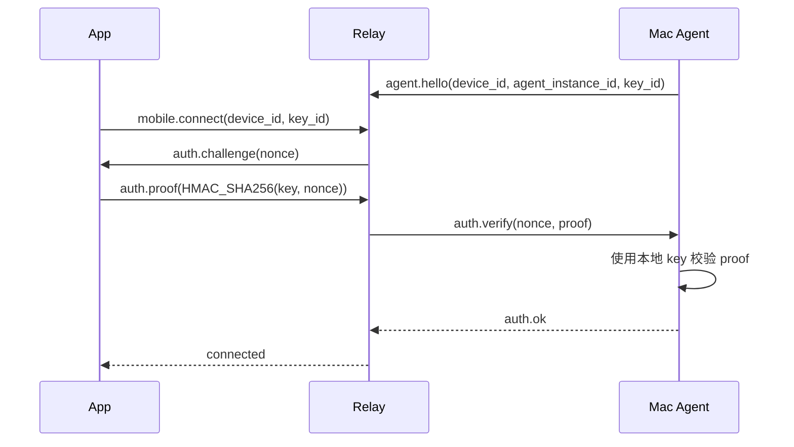

# 临时 Key 鉴权设计

关联文档：

- [engineering-requirements.md](./engineering-requirements.md)
- [mobile-codex-tui-technical-solution.md](./mobile-codex-tui-technical-solution.md)
- [project-directory-structure.md](./project-directory-structure.md)

## 当前结论

当前阶段不接入 SSO，不做企业身份体系，不做长期设备绑定。

MVP 鉴权采用临时共享 key：

- Mac Agent 每次启动时生成一个新的 32 字符随机字符串。
- 该 key 保存到 Mac 本地文件。
- 手机 App 通过手动输入、扫码或后续的本机展示方式获得该 key。
- App 使用该 key 与 Mac Agent 建立本次连接授权。
- Mac Agent 重启后 key 失效，需要重新获取新的 key。

## Key 生成规则

要求：

- 长度固定为 32 个字符。
- 必须使用加密安全随机数生成器。
- 推荐字符集：Base64URL 字符集，即 `A-Z`、`a-z`、`0-9`、`_`、`-`。
- 推荐生成方式：生成 24 bytes 随机数，再做 base64url 无 padding 编码，结果正好 32 字符。
- 不使用时间戳、用户名、设备名、UUID 截断等可预测材料。

示例：

```text
q8LDuJppTK3BU9X3et9bF3gAej-vbLQS
```

## Mac 本地文件

推荐保存位置：

```text
~/Library/Application Support/OmniWork/agent/session-key.json
```

目录权限：

```text
~/Library/Application Support/OmniWork/agent
mode: 0700
```

文件权限：

```text
session-key.json
mode: 0600
```

文件内容：

```json
{
  "version": 1,
  "key": "q8LDuJppTK3BU9X3et9bF3gAej-vbLQS",
  "key_id": "sha256:8f2b7d62d9b0",
  "created_at": "2026-05-12T00:00:00Z",
  "agent_instance_id": "agent_20260512_000001",
  "relay_url": "wss://relay.company.example/agent"
}
```

说明：

- `key` 是本次 Agent 启动生成的临时共享 key。
- `key_id` 是 key 的短 hash 标识，只用于日志和排查，不可作为认证凭证。
- `agent_instance_id` 随 Agent 启动生成，用于区分同一台 Mac 的不同运行实例。
- 文件只保存在本机，不提交仓库，不同步到云盘。

## App 获取 Key

MVP 支持：

- 用户在 Mac 上打开 key 文件后手动复制到 App。
- Mac Agent 在本机终端输出一次 key。
- 后续可提供 Menu Bar 或本地页面展示二维码。

App 侧要求：

- key 不进入普通明文持久存储。
- 如果为了重连短期保存，必须使用 iOS Keychain / Android Keystore / 安全存储封装。
- 当 Mac Agent 重启导致认证失败时，App 清理旧 key 并提示重新输入。

App 收到 `auth.failed` 后的具体清理动作（由 `app/src/app/App.tsx` 实现）：

- 立即调用 `relay.close()` 关闭当前会话连接，避免空跑或重复重连。
- 通过安全存储封装 (`securePairingStore`) 把当前出错的 pairing 从已保存设备列表中移除；只剩唯一一条时退化为 `clearPairing`。
- 将本地缓存的 sessions、workspaces、terminal frame、provider 列表等会话级状态全部清空，避免误用旧 Mac Agent 的数据。
- 如果还有其它已保存设备，跳回 `devices` 页并以 `pairingError` 提示该设备需要重新配对；如果没有任何已保存设备，则进入 `pairing` 页并把刚被拒绝的 pairing 作为 `editingPairing` 预填，引导用户扫描新二维码或粘贴新的 32 字符 key。

## Relay 鉴权流程

Relay 不作为身份系统，只作为连接中继。

推荐握手：



原则：

- App 不应把 key 明文发给 Relay。
- Relay 不保存 key 明文。
- Mac Agent 是 key 校验真相源。
- 握手成功后，Relay 只维护内存态连接授权。
- 连接断开后可以重新 challenge。
- Mac Agent 重启后 `agent_instance_id` 和 key 都变化，旧连接失效。

## 消息头和协议字段

推荐新增消息：

```text
auth.challenge
auth.proof
auth.ok
auth.failed
agent.hello
mobile.connect
```

`auth.proof` payload：

```json
{
  "key_id": "sha256:8f2b7d62d9b0",
  "nonce": "nonce_01",
  "proof": "base64url(hmac_sha256(key, nonce))"
}
```

`auth.failed` 常见原因：

```text
key_mismatch
agent_restarted
key_expired
device_not_online
too_many_attempts
malformed_proof
```

## 安全限制

必须实现：

- key 每次 Mac Agent 启动重新生成。
- key 文件权限为 `0600`。
- key 所在目录权限为 `0700`。
- Relay 对失败次数限流。
- App 认证失败后不无限重试。
- 日志中永远不打印完整 key。
- 审计中只记录 `key_id`，不记录 `key`。

不做：

- 不接入 SSO。
- 不做长期设备绑定。
- 不做 refresh token。
- 不做永久登录态。
- 不把 key 当作长期账户密码。

## 后续可演进

未来如果需要企业化，可以从该 key 方案平滑演进：

- 临时 key 继续作为本机配对 fallback。
- Relay 增加公司身份体系。
- Mac Agent 增加长期设备凭证。
- App 增加企业登录态。
- 管理员增加设备撤销和审计策略。

当前阶段以上能力不进入 MVP。
