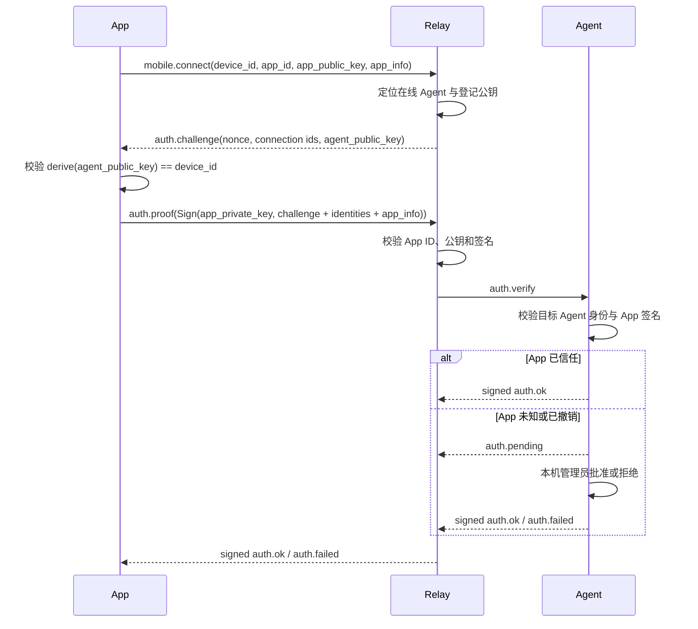

# 身份鉴权方案演进

> 文件名保留用于兼容历史引用。当前实现不再使用共享 Auth Key。

关联文档：

- [identity-auth-design.md](./identity-auth-design.md)
- [engineering-requirements.md](./engineering-requirements.md)
- [relay-architecture-implementation.md](./relay-architecture-implementation.md)

## 当前结论

OmniWork 协议 v2 使用长期非对称身份：

- Agent 首次运行生成 Ed25519 密钥对，`device_id` 由公钥派生。
- App 首次运行生成 Ed25519 密钥对，`app_id` 由公钥派生。
- 配对和分享链接只包含 Relay URL、目标 Agent device ID 与可选名称。
- App 连接时自动携带自己的 ID、公钥和设备/App 元数据。
- Relay 从在线 Agent 连接取得登记公钥，并在 `auth.challenge` 中返回。
- Relay 默认由管理员人工批准新的 Agent identity；也可配置为在 device/IP
  均未封禁时自动授权。
- App 验证该公钥能派生出目标 device ID 后签名 `auth.proof`。
- 默认 `manual` 模式下，未知或已撤销 App 必须由 Agent 本机管理员明确批准；
  显式 `automatic` 模式在签名和 scope 校验后持久化信任。
- 认证完成后使用身份签名的临时 X25519 握手建立 E2E 会话。

不存在 App-Agent 共享 Key、PSK、配对票据或业务明文兼容分支。

## 为什么退役共享 Key

早期 MVP 使用一个 32 字符共享 Key，同时承担配对、认证和 E2E PSK 输入。该
模型存在以下边界问题：

- 链接或二维码必须携带可直接用于认证的秘密，分享目标信息等同于分享权限。
- 多个 App 共用同一秘密，无法区分安装实例，也无法单独批准或撤销。
- Agent 重启轮换临时 Key 会破坏稳定重连；固定 Key 又扩大泄漏影响范围。
- Relay challenge 只能证明持有共享秘密，不能形成 Agent 与 App 的独立身份。
- PSK 同时进入准入和会话密钥派生，职责耦合，难以审计授权来源。

当前方案将职责拆开：

- 目标链接只负责定位。
- Ed25519 长期密钥负责身份。
- Agent Admin 记录负责授权。
- 临时 X25519 密钥负责单次会话前向隔离。

## 本地存储

Agent 身份默认保存在：

```text
~/Library/Application Support/OmniWork/agent/identity-v2.json
```

身份目录权限为 `0700`，文件权限为 `0600`；macOS Keychain 可用时复用同一
身份。身份损坏时拒绝启动，不静默轮换。

Native App 使用平台 Keychain/Keystore 封装身份材料。Web App 使用 WebCrypto
生成不可导出的 Ed25519 私钥，并将 `CryptoKey` 保存到 IndexedDB。

Agent Probe bearer token 是独立的本机接口凭证，不参与 App-Agent 或
Agent-Relay 认证。

## 目标信息导入

App 支持两种等价入口：

1. 手动输入 Relay App WebSocket URL、Agent device ID 和可选名称。
2. 扫描或粘贴同字段的 `omniwork://pair?...` 链接。

两种入口只保存目标信息。App ID、公钥、运行实例和设备/App 元数据由 App 在
连接时自动补充，不进入分享链接。

## App-Agent 认证


```mermaid
sequenceDiagram
  participant A as App
  participant R as Relay
  participant G as Agent

  A->>R: mobile.connect(device_id, app_id, app_public_key, app_info)
  R->>R: 定位在线 Agent 与登记公钥
  R-->>A: auth.challenge(nonce, connection ids, agent_public_key)
  A->>A: 校验 derive(agent_public_key) == device_id
  A->>R: auth.proof(Sign(app_private_key, challenge + identities + app_info))
  R->>R: 校验 App ID、公钥和签名
  R->>G: auth.verify
  G->>G: 校验目标 Agent 身份与 App 签名
  alt App 已信任
    G-->>R: signed auth.ok
  else App 未知或已撤销
    G-->>R: auth.pending
    G->>G: 本机管理员批准或拒绝
    G-->>R: signed auth.ok / auth.failed
  end
  R-->>A: signed auth.ok / auth.failed
```

Relay 的失败限流按目标 device 和接入 IP 维护。合法重连不会消耗失败桶。

定向验证运行 `pnpm verify:identity-auth`；真实 Relay/Agent 链路可使用
`pnpm verify:upgrade:simulator -- --pairing 'omniwork://pair?...'`，或以
`--relay <ws-url> --device <DEV1-id>` 手动指定目标。

## 认证失败后的 App 行为

- 关闭当前传输，停止空转重试。
- 清理 session、workspace、terminal frame 和 provider 等会话级缓存。
- 保留目标设备条目及错误状态，允许用户编辑 Relay URL 或删除设备。
- 身份不匹配、撤销或未知 App 不通过复制新链接绕过审批。

## 已删除的旧机制

以下旧机制不再属于协议或配置：

- `agent.key`、`OMNIWORK_AGENT_KEY` 和 `session-key.json`。
- `auth.proof = HMAC_SHA256(shared_key, nonce)`。
- 加密分享链接、4 位二维码密码和短时共享 Key。
- `key_mismatch`、`key_expired` 等共享 Key 专用失败原因。
- 以共享 Key/PSK 派生业务会话密钥。

代码和文档不得重新引入这些入口作为兼容 fallback。
