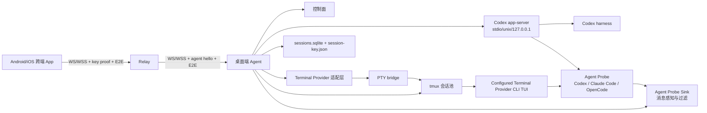
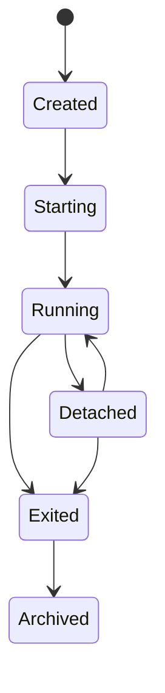

# 手机端 Codex TUI 工作台技术方案

关联设计文档：[mobile-codex-tui-workbench-design.md](./mobile-codex-tui-workbench-design.md)

关联工程要求：[engineering-requirements.md](./engineering-requirements.md)

关联鉴权设计：[auth-key-design.md](./auth-key-design.md)

关联中继与传输方案：[relay-architecture.md](./relay-architecture.md)（终版架构）

关联 Agent 消息感知与推送设计：[agent-probe-sink-design.md](./agent-probe-sink-design.md)

## 实装状态

- 终端主通道（Terminal Provider adapter）：已落地基础适配层，见 [desktop/agent/src/terminal-provider/](../desktop/agent/src/terminal-provider/)；provider 配置驱动 + `session.list` 下发已对齐。
- Surface 协议层：`TerminalSession` 已下发 `primary_surface_id` 与 `surfaces`；终端输入、resize、snapshot、stream 和 frame 消息保留 `session_id` 作为归属信息，并以 `surface_id` 作为具体交互入口和缓存路由键。
- 兼容通道（tmux + Native WebView/xterm 终端）：已落地，见 [desktop/agent/src/pty-bridge](../desktop/agent/src/pty-bridge)、[desktop/agent/src/tmux-manager](../desktop/agent/src/tmux-manager) 与 [app/src/terminal](../app/src/terminal)。
- Codex app-server adapter 尚未完成进程管理和主动订阅；当前已落地 `codexAppServerNormalizer` 与本机 HTTP ingest endpoint，可把 app-server 的 thread / turn / approval / diff / completion 事件归一化为 `AgentProbeEvent`，供消息、通知和后续 AgentSurface timeline 复用。
- Terminal Provider 元数据层：`packages/protocol-ts` 定义 + 桌面端 Agent 配置化 provider 已实现。
- Agent Probe Sink 消息感知层：已落地 MVP 骨架，见 [desktop/agent/src/probes](../desktop/agent/src/probes)。当前实现包含 `agent.message*` 协议类型、Codex / Claude / Trae / Trae-CN hook receiver、Desktop Agent 启动时 Codex / Claude hook 自动安装、hook 归一化、Codex app-server event HTTP ingest、Claude Code 官方生命周期 hook 主干映射、`claudecode` 输入别名归一化、Trae / Trae-CN hook provider 归一化、tmux target missing Probe、接收端按现有 session/workspace/provider 自动关联 `surface_id`、SQLite pending inbox、已读回执、通知偏好持久化、脱敏系统通知候选 payload 和在线 App `agent.message` 广播；平台原生系统 Push gateway 尚未落地。
- Workspace 上下文层：已实现 `workspace.list/status` + `files.list/read/write` + `git.status/diff`，其中文件写入仅支持受控 UTF-8 文本编辑，详见 [desktop/agent/src/workspace](../desktop/agent/src/workspace) / [files](../desktop/agent/src/files) / [git](../desktop/agent/src/git)。
- Relay + P2P 升级：已落地（终版见 [relay-architecture.md](./relay-architecture.md)），不在本文档继续维护。

## 结论摘要

推荐采用「公司内网中继 + TypeScript 电脑 本地 Agent + Terminal Provider 适配层 + Android/iOS/Web 跨端 App」的方案。

技术判断需要补充一个重要约束：

- OpenAI Codex 已经提供官方的 `codex app-server` 和 `--remote` 能力，可以用 JSON-RPC 和 WebSocket 驱动更结构化的 Codex 客户端。
- 但 Codex app-server 的 WebSocket 传输目前仍标注为 experimental / unsupported，且官方明确提醒非 loopback WebSocket 监听在 rollout 过程默认不应直接远程暴露，必须配置认证。
- 因此，正式企业方案不应把 Codex app-server 直接暴露给手机或中继，而应由 桌面端 Agent 在本机 loopback / unix socket / stdio 内部管理，再通过我们自己的企业中继协议对外提供受控能力。

最终推荐是双通道架构，同时保留 Terminal Provider 抽象，避免把 Codex、Claude、Gemini、OpenCode 等 CLI 能力写死在 App 页面或 桌面端 Agent 会话管理逻辑中：

1. **主通道：Codex App Server 结构化通道**
   - 面向产品化体验。
   - 用于会话、线程、审批、流式事件、历史记录、状态摘要。
   - 手机端可以做移动友好的 Codex UI，而不必完整复刻桌面 TUI。

2. **兼容通道：tmux + Native WebView/xterm 终端通道**
   - 面向最小闭环和兼容性。
   - 用于真实显示 Codex CLI TUI。
   - 可满足「手机查看 TUI 结果并交互、多个 TUI 切换」的 MVP 诉求。

3. **Terminal Provider 元数据层**
   - `packages/protocol-ts` 定义 `TerminalProviderDefinition`、`terminal_provider_kind`、能力标识等共享协议类型，并提供默认 presets 作为 fallback。
   - 桌面端 Agent 通过 `OMNIWORK_TERMINAL_PROVIDERS` 配置实际启用的 provider、展示名、能力标识和命令，例如用户可直接增加 `opencode`。
   - 桌面端 Agent 的 Terminal Provider Registry 从配置化 provider 列表创建终端启动命令，并通过 `agent.hello` / `session.list` 下发给 App。
   - App 会话列表按 桌面端 Agent 下发的 provider 分组展示，并在创建会话时传递 `terminal_provider_kind`。
   - 未识别的外部 tmux 会话归入 `other`，只展示和附加，不作为可创建 provider。

4. **Workspace 上下文层**
   - Workspace 是远端项目目录，不是 Agent 端静态配置；桌面端 Agent 从 managed session 和 external tmux session 的 cwd 自主发现 workspace。
   - 如果 session cwd 位于 Git 仓库内，workspace path 提升为 Git root；否则使用 cwd 本身。workspace path 是稳定标识，展示名为空时使用路径最后一级目录。
   - `session.list` 下发 workspace 元数据，App 以 Workspace 作为一级项目对象；Workspace Detail 使用底部 Tab 展示 `Sessions` / `Git` / `Files`。
   - `Sessions` Tab 按 provider 分组，例如 OmniWork workspace 内展示 Codex、Claude、OpenCode 各自相关的 session。
   - `Files` Tab 允许在 workspace 边界内浏览、预览文件，并对支持的 UTF-8 文本文件执行受控编辑；保存通过打开时的内容哈希做冲突检测，禁止通过相对路径越界。
   - `Git` Tab 仅当目标 workspace 是 Git 仓库时显示，能力限制为只读 `status` / `diff`，不提供 stage、commit、reset、push 等写操作。

5. **Agent Probe Sink 消息感知层**
   - Codex、Claude Code、Trae、Trae-CN、OpenCode、Gemini CLI 等 coding agent 各自实现专属 Agent Probe，通过 hook 或结构化事件源感知自身运行状态和事件。
   - Codex Probe 采用三通道：app-server 结构化主路径、Codex hooks 生命周期补充路径、PTY/tmux 兼容兜底路径。
   - 桌面端 Agent 内部提供统一 `Agent Probe Sink`，接收不同 Probe 上报的 `AgentProbeEvent`。
   - Probe 只负责感知和归一化，不直接推送 App，也不直接连接 Relay。
   - 桌面端 Agent 内部消息过滤层负责去重、频控、权限、敏感信息裁剪和通知升级。
   - App 只消费过滤后的 `AgentAppMessage`，不理解 Codex / Claude Code 私有事件协议。
   - 详细设计以 [agent-probe-sink-design.md](./agent-probe-sink-design.md) 为准。

MVP 可以采用兼容通道。正式企业版建议兼容通道与主通道并存：默认使用结构化通道，必要时切换到原始 TUI。

## 工程技术栈要求

已确认的工程要求：

- 桌面端采用 TypeScript / Node.js 技术栈。
- 桌面端 Agent 的业务主体不采用 Rust/Swift 重写。
- 如需 电脑系统 原生能力，只允许做极薄平台桥接，例如 Keychain、LaunchAgent、签名公证和可选 Menu Bar shell。
- App 采用 React Native 技术栈，同时适配 Android、iOS 和 Web SPA。
- 手机端推荐采用 React Native CLI + TypeScript。
- 原始 TUI 快照通过 React Native 原生组件渲染；完整 ANSI renderer 作为可替换能力。
- 结构化 Codex UI 使用 React Native 原生组件实现。
- App 和 桌面端 Agent 共享 TypeScript 协议类型和纯逻辑 SDK。
- 登录鉴权不接入 SSO；桌面端 Agent 每次启动生成 32 字符临时 key，保存到本地文件，App 使用该 key 完成本次连接授权。
- App 移动端交付 Android APK 和 iOS IPA 安装包；Web 端以 `react-native-web` 输出静态 SPA，不作为 PWA 或扫码入口。

「手机 PWA 优先」和「电脑 企业版迁移 Rust/Swift」不作为主方案。App 继续以 React Native 为唯一 UI 技术栈，移动端按 APK/IPA 交付，Web 端只作为同代码库 SPA 目标；Rust/Swift 只作为 Relay 可选实现或极薄 电脑系统 原生桥接。

## 技术判断要点

### Codex 官方能力

Codex CLI 不仅支持传统交互式 TUI，也支持 app-server 协议。官方文档说明：

- Codex CLI 是运行在本地终端的 coding agent，可以读取、修改并运行本机目录中的代码。
- Codex app-server 是官方用于 VS Code extension、桌面 App 等 rich client 的接口。
- app-server 使用类似 MCP 的 JSON-RPC 2.0 双向通信，支持 stdio、WebSocket、off 等监听模式。
- WebSocket 模式中，一个 JSON-RPC 消息对应一个 WebSocket text frame。
- app-server 可暴露 `/readyz` 和 `/healthz` 健康检查。
- `codex --remote ws://...` 可以让交互式 TUI 连接远端 app-server。
- app-server 提供 thread、turn、item 级事件，可作为 Codex Probe 的结构化主信号源。
- Codex hooks 提供 SessionStart、UserPromptSubmit、PreToolUse、PermissionRequest、PostToolUse、Stop、SubagentStart/Stop、PreCompact/PostCompact 等生命周期事件，可作为 Codex Probe 的补充信号源。

关键限制：

- app-server WebSocket 传输仍是 experimental / unsupported。
- 非 loopback WebSocket 监听目前不应直接远程暴露。
- 暴露 WebSocket 时需要配置 capability token 或 signed bearer token。
- app-server 使用 bounded queues；客户端需要处理 overloaded / retry。
- hooks 需要遵守 Codex 的信任模型；非 managed hook 需要用户 review/trust，managed hook 应由企业配置或 MDM 下发。

技术判断：

- 直接把 app-server 暴露给手机不合适。
- 桌面端 Agent 应作为 app-server 的本地守护和安全边界。
- 公司中继只面对 桌面端 Agent 和手机，不直接面对裸 Codex app-server。
- Codex Probe 的主路径是 app-server 事件订阅，hooks 只把事件投递给 Desktop Agent 本地 hook receiver，不能直接推送 App 或 Relay。

### Web SPA 与浏览器终端技术

`@xterm/xterm` 稳定包是 6.0.0，是成熟的浏览器端终端组件。Web 端通过 platform suffix（`NativeTerminalView.web.tsx`）直接挂载 xterm.js；iOS / Android 端通过 `NativeTerminalView.native.tsx` 使用 `react-native-webview` 加载内嵌 xterm HTML，并通过 `postMessage` 建立 `write/onData/fit/resize` 双向桥。这样三端都使用 xterm 处理终端输入、选择、复制、粘贴和 IME，RN `<Text>` 快照视图仅保留为 fallback。

技术判断：

- Web 端使用 `@xterm/xterm` + `@xterm/addon-fit` + `@xterm/addon-clipboard` + `@xterm/addon-web-links`，由 xterm 的隐藏 textarea 接管键盘输入与 IME，去除原本 `TerminalScreen` 中的全局 `keydown` 兜底监听。
- iOS / Android 端使用 `react-native-webview` 承载同版本 xterm HTML，RN 侧通过 `injectJavaScript` 写入 frame / resize / fit，WebView 侧通过 `postMessage` 回传输入与尺寸；xterm CSS/JS/addon 资源必须由 `app/scripts/generateXtermWebViewAssets.mjs` 从已安装的 `@xterm/*` 依赖生成，不得运行时访问 CDN。
- 协议保持不变：桌面端 agent 仍下发整屏 ANSI 文本帧（`terminal.frame`），xterm 端在收到新 frame 时执行 `terminal.reset()` + `terminal.write(frame)` 覆盖；终端尺寸以 xterm fit 后的真实 `cols/rows` 为准，并由 App 回传驱动后端 resize。
- 桌面端 Agent 通过 tmux capture/snapshot 提供终端画面。
- App 先做文本归一化、ANSI 控制序列清理、横向/纵向滚动、快捷键输入。
- 如果演进需要完整 ANSI 行为，再以可替换 renderer 引入，不能复制整套 Web 页面。

#### 终端字体与尺寸适配约束

字体大小配置约束：切换字号后 console 底部内容必须完整可见，并可通过滚动查看。有效修复原则证明，根因不是单一的底部 padding、`rows` 最小值、`minHeight` 或 frame 重写问题，而是尺寸权威来源被破坏：RN 侧用 `computeTerminalLayout` 估算出的 `terminalSize` 主动触发后端 resize，同时 xterm 端又基于真实 DOM / WebView 容器进行 fit，两套尺寸来源竞争，导致后端 snapshot、xterm viewport 和实际可见区域不同步。

最终修复原则是保留 FitAddon 相关三要素，三者缺一不可：

- **FitAddon 实测**：Web 端 `NativeTerminalView.web.tsx` 必须使用 `@xterm/addon-fit`，Native WebView 内部也必须加载 xterm fit addon；最终 `cols/rows` 由 `fitAddon.proposeDimensions()` / `fitAddon.fit()` 基于真实 DOM 或 WebView 容器计算。
- **容器变化触发**：Web 端必须用 `ResizeObserver` 在终端宿主节点尺寸变化时重新 `fit()`；Native 端必须在 WebView `onLayout`、窗口 resize、字体 `setFont` 后触发 WebView 内部 `fit()`。
- **尺寸上报回后端**：每次 fit 后必须通过 `reportSize` / `postMessage({ type: "resize" })` 将 xterm 的真实 `cols/rows` 回传给 App，再由 App 同步给后端刷新 snapshot；不能只在前端本地 fit 而不通知后端。
- 字体变化时只更新 xterm `fontSize` / `lineHeight`，然后按上述三要素重新 fit、上报、刷新；RN 侧不直接决定 Web / WebView xterm 的最终行列数。
- `TerminalScreen` 不应在字体变化时使用 `computeTerminalLayout(...).terminalSize` 主动调用 `onResize`；否则会把估算尺寸重新写回后端，覆盖 xterm fit 上报的真实尺寸。
- `terminalSize` 是协议层的后端/session 尺寸状态，也可作为创建 session、xterm 初始化或非 xterm fallback 的初始值；它不是 Web / WebView xterm 的实时显示尺寸权威。
- `computeTerminalLayout` 可以继续提供字体、行高、初始尺寸、UI 元信息或非 xterm fallback，但不能替代 xterm fit 成为 Web / WebView 端最终 `cols/rows` 的来源。
- 不要再通过调整 `rows` 下限、容器 `minHeight`、底部安全距离或 resize 后重写 frame 来修复此类底部裁剪；这些补丁只能缓解局部场景，不能解决 snapshot 尺寸与 viewport 尺寸不一致。

### PTY 与 tmux

`tmux` 的核心能力是终端复用和会话持久化：session 可以 detach 后继续在后台运行，并在之后 reattach。每个 session 可以包含多个 window / pane，每个 pane 是独立 pseudo terminal。

技术判断：

- Codex TUI 的持久化应交给 `tmux`。
- 桌面端 Agent 不应自己模拟 session 生命周期。
- 每个手机可切换会话对应一个 `tmux` session 或 window。
- 桌面端 Agent 重启后通过 `tmux list-sessions` 重新发现会话。

PTY 实现方式：

- 桌面端 Agent 使用 TypeScript / Node.js。
- MVP 通过 `pty-bridge` 调用 `tmux-manager` 完成输入发送和快照抓取。
- 如演进引入 `node-pty`，只能作为 `pty-bridge` 后面的可替换底层适配。
- `tmux` 操作必须封装在 `tmux-manager` 模块后面。
- 如需 native addon，只能作为 Node.js TypeScript Agent 的底层适配层，不承载业务逻辑。

建议：

- 桌面端 Agent 从 MVP 开始就按 TypeScript 生产结构组织，不再单独规划 Rust/Swift 迁移方案。
- 企业部署能力重点解决 Node runtime 固定、签名、公证、自启动、Keychain、MDM 配置和打包分发。
- 电脑系统 原生桥接保持最薄，不把 Agent 业务逻辑下沉到 Swift/Objective-C。

### WebSocket 与 WebTransport

WebSocket 仍是 MVP 主通信协议。MDN 说明 WebSocket 是浏览器和服务端之间的双向交互通信 API，支持广泛，但标准 WebSocket API 本身没有 backpressure；如果消息到达速度超过应用处理速度，可能导致内存增长或 CPU 占用过高。

WebTransport 是更现代的 HTTP/3 传输能力，支持多 stream、单向 stream、乱序、datagram 和更好的低延迟网络切换；但 W3C 规范仍是 Working Draft，且企业代理、网关、TLS 检查、HTTP/3 支持链路更复杂。

技术判断：

- MVP 使用 WebSocket 作为传输，允许 `ws://` 与 `wss://`；业务安全由 App-Agent E2E 加密承担。
- 协议层自己实现 seq / ack / flow-control。
- WebTransport 列入可选实验，不进入 MVP 主链路。

### 跨端移动 App 与通知

- App MVP 建议使用 React Native CLI 作为跨端技术，同时交付 Android、iOS 和 Web SPA。

技术判断：

- Android、iOS 和 Web 共享同一套 TypeScript 业务代码。
- 原始 TUI 页面使用 Native App 内的 WebView/xterm 终端视图，WebView 仅承载本地打包资源。
- 结构化 Codex UI 使用 React Native 原生组件实现，避免被 WebView 体验限制。
- 任务完成通知使用 APNs / FCM 或公司统一推送网关。
- 需要明确：手机 App 切后台、锁屏或系统回收后，长连接仍可能暂停，所以 24 小时能力必须依赖 桌面端会话持久，而不是手机端在线。
- 移动端交付物是 APK / IPA 安装包；Web 交付物是静态 SPA，不提供 PWA 或扫码能力。

### 电脑系统 企业部署

桌面端 Agent 是公司设备上的本地常驻组件，应优先使用 Apple 官方系统能力：

- 电脑系统 13+ 使用 `SMAppService` 注册和管理 LoginItems、LaunchAgents、LaunchDaemons。
- MVP 不使用持久认证 token；Agent 每次启动生成临时 key，并以权限受限的本地文件保存。
- 如演进引入持久凭证，再使用 Keychain 保存设备凭证或 relay secret。
- 企业分发需要签名和 notarization。
- 如果公司 MDM 支持，可使用 Managed Device Attestation 参与设备信任判断。

技术判断：

- 桌面端 Agent 不需要 SSH、屏幕录制或辅助功能权限。
- 桌面端 Agent 需要最小文件系统和网络权限。
- 桌面端 Agent 默认只主动连接配置的 Relay；Relay 可为公司或第三方部署，业务安全不依赖 Relay 可信或 TLS 终止。

## 推荐总体架构



## 模块拆分

### 手机跨端 App

职责：

- 临时 key 输入 / 扫码配对。
- 设备选择。
- 会话列表。
- 原始 TUI 渲染。
- 结构化 Codex 会话 UI。
- 输入和快捷键。
- 横屏、缩放、复制、粘贴。
- 断线重连。
- APNs / FCM / 公司统一推送订阅。

推荐技术：

- TypeScript。
- React Native CLI。
- Native WebView/xterm 终端视图，本地打包终端资源。
- WebSocket client。
- 安全存储使用平台安全存储能力。
- 通知使用 APNs / FCM 或公司统一推送网关。

手机端页面：

- `PairingScreen`：输入或扫码 32 字符临时 key。
- `DeviceListScreen`：选择 电脑。
- `SessionListScreen`：会话列表。
- `TerminalScreen`：原始 TUI 快照，Native WebView/xterm 终端视图；RN 文本快照仅作为 fallback。
- `CodexAgentSurfaceScreen`：结构化 Codex UI。
- `SettingsScreen`：安全、通知、键盘偏好。

### 公司内网 Relay

职责：

- 手机临时 key proof 校验中继。
- 桌面端 Agent 在线注册。
- App 连接与 桌面端 Agent 实例匹配。
- 中继手机和 桌面端 Agent 之间的数据。
- 会话路由。
- 连接状态管理。
- 审计日志。
- 管理员撤销。
- 速率限制和异常保护。

推荐技术：

- Go 或 Rust。
- WebSocket 传输，业务消息强制 App-Agent E2E 加密。
- MVP 不接入 SSO / OIDC。
- App 使用 32 字符临时 key 的 HMAC proof 完成连接授权。
- 桌面端 Agent 使用 `agent.hello` 注册 `device_id`、`agent_instance_id`、`key_id`。
- PostgreSQL 存设备、Agent 实例、审计元数据。
- Redis 用于在线状态、临时路由、分布式锁。
- OpenTelemetry 做 trace / metrics。

不建议：

- 不在 Relay 上保存完整终端内容。
- 不在 Relay 上保存完整 key。
- 不把 Relay 设计成任意命令执行网关。
- 不让手机直接访问 电脑 上的 Codex app-server。

### 桌面端 Agent

职责：

- 与 Relay 建立出站连接。
- 注册设备状态。
- 管理本机 Codex 会话。
- 启动和监督 `codex app-server`。
- 启动和监督 `tmux` / Codex TUI。
- 提供内部 `Agent Probe Sink`，接收 Codex、Claude Code、OpenCode、Gemini CLI 等专属 Probe 的事件。
- 对 Probe 事件执行归一化、去重、频控、敏感信息过滤和通知升级。
- 将本地 PTY / app-server 事件转换为企业中继协议。
- 存储本地会话 registry。
- 每次启动生成 32 字符临时 key。
- 将临时 key 保存到权限受限的本地文件。
- 上报审计事件。

推荐技术方案：

- TypeScript + Node.js LTS。
- PTY：为 `pty-bridge` + `tmux-manager`；`node-pty` 是可替换底层适配。
- 会话持久：`tmux`。
- 打包：固定 Node runtime 的 电脑系统 分发包。
- 自启动：`SMAppService` 注册 LaunchAgent。
- 本地存储：SQLite，默认路径 `~/Library/Application Support/OmniWork/agent/sessions.sqlite`；首次打开会从同目录旧 `sessions.json` 自动导入，显式传入 `.json` 存储路径时会自动映射到同名 `.sqlite`。
- 临时 key 文件：`~/Library/Application Support/OmniWork/agent/session-key.json`。
- 演进持久 secret：Keychain。
- 与 app-server 通信：优先 stdio 或 unix socket；必要时 loopback WebSocket。

工程约束：

- Agent 业务主实现必须在 TypeScript 中。
- 电脑系统 原生代码只做 Keychain、LaunchAgent、签名公证、可选 Menu Bar 等薄桥接。
- `node-pty`、Keychain 等演进 native 依赖必须收敛在独立 adapter 模块内；SQLite 存储统一封装在 `session-store`。
- 不依赖用户机器上不受控的全局 Node 版本。

桌面端 Agent 的本地端口策略：

- 默认不监听 LAN 地址。
- 如果需要本机调试，只监听 `127.0.0.1`。
- 不直接开放 Codex app-server 到公司网络。

### Codex Runtime Adapter

运行时适配层统一屏蔽两种 Codex 访问方式。

#### App Server Adapter

用于结构化能力。

能力：

- `thread/list`
- `thread/start`
- `thread/resume`
- turn events streaming
- approvals
- diffs
- history
- auth endpoints

实现原则：

- app-server 进程只在 电脑 本机内部可达。
- adapter 将 app-server JSON-RPC 事件转换为 Relay protocol。
- 手机端不直接依赖 app-server 原始协议，以降低 Codex 升级风险。
- adapter 负责版本探测和 feature flag。

#### PTY Adapter

用于原始 TUI 能力。

能力：

- 创建 `tmux` session。
- 启动 `codex` TUI。
- attach 到指定 session。
- 推送 terminal frame。
- 写入键盘输入。
- resize。
- snapshot。
- reconnect。

实现原则：

- 每个 TUI 会话固定 `session_id`。
- 后台运行交给 `tmux`。
- WebSocket 慢客户端不能拖垮 PTY 读取，需要缓冲和丢弃策略。
- 对每个会话维护会话输出和屏幕快照。
- 终端帧由 桌面端 Agent 主动推送：`desktop/agent/src/core/agentService.ts` 为每个 attached session 启动一个 ~450ms 的定时器，对PTY 内容做 SHA-1 哈希，仅当哈希变化时下发 `terminal.frame`，避免无变化空帧；App 不再做 3 秒 idle 全量轮询或输入后多次轮询，进入终端页时只主动拉取一次 `terminal.snapshot` 作为初始画面。

## 协议设计

### 外层连接

手机与 Relay：

```text
ws://relay.example/relay/ws/mobile 或 wss://relay.example/relay/ws/mobile
auth.proof: HMAC_SHA256(session_key, relay_nonce)
e2e: Noise_NNpsk0_25519_ChaChaPoly_BLAKE2s
```

桌面端 Agent 与 Relay：

```text
ws://relay.example/relay/ws/agent 或 wss://relay.example/relay/ws/agent
agent.hello: device_id + agent_instance_id + key_id
e2e: Noise_NNpsk0_25519_ChaChaPoly_BLAKE2s
```

其中 `session_key` 是 桌面端 Agent 本次启动生成的 32 字符临时 key。Relay 不应持久化或打印完整 key；推荐由 Relay 发起 nonce，App 计算 proof，桌面端 Agent 使用本地 key 校验。鉴权成功后还必须完成 App-Agent Noise E2E 握手，业务消息只能封装在 `e2e.message` 中。

### 消息 Envelope

```json
{
  "v": 1,
  "id": "msg_01",
  "type": "terminal.input",
  "device_id": "desktop_01",
  "session_id": "sess_01",
  "seq": 42,
  "ts": "<ISO_TIMESTAMP>",
  "payload": {}
}
```

字段说明：

- `v`：协议版本。
- `id`：消息 ID，用于追踪。
- `type`：消息类型。
- `device_id`：目标 电脑。
- `session_id`：目标 Codex session。
- `seq`：有序流序号。
- `ts`：发送时间。
- `payload`：业务负载。

### 主要消息类型

控制面：

```text
auth.challenge
auth.proof
auth.verify
auth.ok
auth.failed
agent.hello
agent.heartbeat
device.list
session.list
session.create
session.rename
session.close
session.kill_terminal
session.attach
session.detach
session.status
```

TUI 数据面：

```text
terminal.frame
terminal.input
terminal.resize
terminal.snapshot
terminal.ack
terminal.error
```

Codex 结构化面：

```text
codex.thread.list
codex.thread.start
codex.thread.resume
codex.turn.start
codex.turn.event
codex.approval.request
codex.approval.answer
codex.diff.event
codex.error
```

Agent 消息感知与投递面：

```text
agent.probe.event
agent.message
agent.message.list
agent.message.read
agent.message.ack
agent.notification.settings.get
agent.notification.settings.set
```

其中 `agent.probe.event` 是桌面端 Agent 内部 Probe 到 Sink 的逻辑事件，不应通过 Relay 暴露给 App；App 只接收过滤后的 `agent.message` 及其同步、已读和回执消息。

### Backpressure

WebSocket 本身不提供标准 backpressure，因此协议层必须实现：

- terminal frame `seq`。
- 客户端定期发送 `terminal.ack`。
- 每个连接设置最大未确认字节数。
- 超限后进入降级策略：
  - 暂停非关键帧。
  - 合并连续输出。
  - 只保留屏幕快照。
  - 向用户显示「连接较慢，已进入快照模式」。

TUI 输出分两类：

- 交互帧：实时推送，尽量低延迟。
- 快照帧：慢连接或重连时发送屏幕状态。

## 会话模型

### Relay 侧表

```text
users
devices
device_bindings
agent_connections
mobile_connections
relay_sessions
audit_events
push_subscriptions
```

### 桌面端 Agent 本地表

```text
codex_sessions
tmux_sessions
app_server_instances
terminal_snapshots
agent_probe_events
agent_app_messages
agent_message_deliveries
agent_notification_settings
agent_settings
```

### 会话状态



状态定义：

- `Created`：元数据已创建。
- `Starting`：正在启动 Codex / tmux / app-server。
- `Running`：会话运行中。
- `Detached`：无人连接但后台运行。
- `Exited`：Codex 进程已退出。
- `Archived`：不可交互，仅保留元数据。

> 备注：协议层不再使用 `Error` 状态。任何瞬态错误（例如 `session.create` 时 tmux 启动失败）通过 `terminal.error` envelope 直接反馈给前端，后端不再写入 `status="error"` 占位。tmux 会话一旦消失，进程内对话上下文也随之丢失，无法"恢复成同一个 session"。`SessionManager.list()` 在对账时会直接将这些孤儿条目从持久化 store 中删除（不再保留 Error 占位、不提供 Recover/Retry/Restart 操作）。删除时按 `tmux_server_pid_mismatch` / `tmux_session_uid_mismatch` / `not_in_tmux_ls` 三类 reason 写入结构化日志，便于排查"会话突然消失"。

## 手机端 TUI 体验方案

MVP 推荐：

- React Native 页面中嵌入 Native WebView/xterm 终端视图，终端资源本地打包。
- 终端帧先做 ANSI 文本归一化，再交给 xterm 渲染。
- 横向/纵向滚动和横向拖动由 xterm/WebView 内部处理，并通过 RN bridge 同步输入与尺寸。
- 终端逻辑尺寸由 xterm FitAddon 基于真实容器测量后上报。
- 手机上默认缩放到宽度适配。
- 支持双指缩放。
- 横屏时切换到宽终端。
- 底部固定输入栏参与终端 viewport 避让，避免覆盖 TUI 底部内容。
- 右侧浮动控制条支持长按后仅调整 Y 坐标，并按终端显示区域高度限制可移动范围。
- 快捷键栏提供：
  - `Esc`
  - `Tab`
  - `Ctrl+C`
  - `Ctrl+D`
  - `Ctrl+L`
  - 方向键
  - 回车
  - 复制
  - 粘贴

输入策略：

- 普通文本先进入手机输入栏，点击发送后写入 PTY。
- 快捷键即时发送。
- 支持「粘贴前预览」，避免大段文本误发送。
- iOS 中文 IME 使用 React Native 输入栏承接，提交后再写入 PTY。

安全策略：

- 默认禁用终端程序直接读剪贴板。
- 对 OSC 52 剪贴板写入做确认或禁用。
- 链接点击前展示目标域名。
- 不允许终端输出注入 HTML。

## Codex 结构化 UI 体验方案

更适合手机的主体验不是完整 TUI，而是结构化 Codex UI。

建议支持：

- 对话流。
- turn 状态。
- Codex plan。
- tool call 列表。
- diff 摘要。
- approval 卡片。
- 任务完成通知。
- 多 session 并行状态。
- 快速继续输入。

技术上由 App Server Adapter 提供事件流，手机端渲染移动友好的 UI。

好处：

- 不受终端宽度限制。
- 审批交互更适合手机。
- 可以做通知和摘要。
- 可以更精细地审计操作。

保留 TUI 的原因：

- 兼容用户已有 CLI 使用习惯。
- Codex TUI 新功能可以立即可见。
- 当 app-server 协议变化时，有原始 TUI 兜底。

## 安全方案

### 鉴权

MVP 不接入 SSO / OIDC / 持久设备绑定。

临时 key：

- 桌面端 Agent 每次启动生成一个新的 32 字符随机 key。
- key 使用加密安全随机数生成器。
- key 保存到 `~/Library/Application Support/OmniWork/agent/session-key.json`。
- key 文件权限必须为 `0600`，目录权限必须为 `0700`。
- App 通过手动输入、扫码或演进本机展示方式获得 key。
- 桌面端 Agent 重启后旧 key 失效。

推荐握手：

- Relay 下发 nonce。
- App 使用 key 对 nonce 计算 `HMAC-SHA256` proof。
- Relay 将 proof 转发给 桌面端 Agent。
- 桌面端 Agent 使用本地 key 校验 proof。
- Relay 不保存完整 key。
- 审计只记录 `key_id`，不记录 key。
- App 收到 `auth.failed` 时立即关闭 relay 连接，并按 [auth-key-design.md](./auth-key-design.md) 的「App 收到 `auth.failed` 后的具体清理动作」清除本地失效 pairing 与会话状态，引导用户重新扫码或输入新的临时 key。

### 授权

授权判断：

```text
device_id + agent_instance_id + key_id + key_proof
```

默认策略：

- 拥有本次临时 key 的 App 才能连接对应 桌面端 Agent。
- 同一 桌面端 Agent 重启后必须重新配对。
- 默认不支持跨用户共享或持久授权。
- key 连续校验失败需要限流。

### 审计

默认记录元数据：

- key 配对成功 / 失败。
- 连接 / 断开。
- 会话创建 / 关闭。
- 会话 attach / detach。
- approval allow / deny。
- Agent 版本。
- Codex 版本。
- `key_id`。
- 来源 IP / 网络区域。

终端内容审计：

- 默认不记录完整 TUI 输出。
- 可按公司安全要求开启敏感操作抽样或完整记录。
- 如果开启完整记录，需要明确数据保留期限和访问权限。

### 进程边界

桌面端 Agent 只允许：

- 启动 `codex`。
- 启动 `codex app-server`。
- 启动和管理白名单 `tmux` session。

桌面端 Agent 不允许：

- 任意远程 shell。
- 任意命令执行 API。
- 读取屏幕。
- 控制鼠标。
- 监听全局键盘。
- 绕过 MDM、代理、VPN 或防火墙。

## 技术选型表

| 领域 | 推荐 | 备选 | 不推荐作为主线 |
| --- | --- | --- | --- |
| 手机端 | React Native CLI + TypeScript，产出 APK/IPA | Flutter | 只做 PWA 或网页作为主交付 |
| 原始终端 | Native WebView/xterm 终端视图，本地打包终端资源 | 可替换原生 terminal renderer | Android/iOS 分别自研终端渲染器 |
| TUI 持久化 | tmux | screen / zellij | Agent 自己模拟持久终端 |
| Codex 结构化集成 | Codex app-server adapter | Codex SDK 用于非交互任务 | 直接暴露 app-server 给手机 |
| 桌面端 Agent | TypeScript + Node.js LTS + tmux-manager/pty-bridge | node-pty 或极薄 native addon | Rust/Swift 承载 Agent 业务 |
| 中继 | Go / Rust WebSocket Relay | Node.js Relay | 通用远控网关 |
| 认证 | 32 字符临时 key + HMAC challenge | 演进 SSO / OIDC | 静态持久共享密码 |
| Agent 设备认证 | agent.hello + key_id + proof 校验 | 演进 mTLS / signed bearer | 无认证 WebSocket |
| key 存储 | `session-key.json`，0600 权限 | 演进 Keychain 存持久凭证 | 仓库内明文配置 |
| 通知 | APNs / FCM / 公司统一推送 | 公司内部调试通道 | WebSocket 长久在线 |

## 现有项目参考

### Remodex

Remodex 是一个开源的 Codex 远程控制参考项目，包含 电脑 本地 bridge 和 iOS App，主打 local-first、iPhone 控制 电脑 上的 Codex、配对、安全会话、通知、运行流式展示等能力。

可借鉴：

- 手机控制 Codex 的产品交互。
- 一次性 QR 配对。
- 电脑 bridge。
- 通知和长任务反馈。
- local-first 思路。

不建议直接采用为企业方案的原因：

- 公司网络、SSO、MDM、审计、设备绑定策略通常需要深度定制。
- 目标是公司内网中继和合规边界，不是个人自托管体验。
- 需要适配受控 电脑、不可 SSH、不可屏幕共享的企业约束。

### ttyd / Wetty / Guacamole / code-server

这些项目证明了浏览器终端和远程开发工作台的成熟度：

- `ttyd`：轻量 web terminal。
- `Wetty`：xterm.js + WebSocket 的 web terminal。
- Apache Guacamole：更偏通用远程桌面 / SSH / RDP / VNC 网关。
- code-server：完整 VS Code 浏览器化。

技术判断：

- 可以参考实现，但不建议直接作为主产品核心。
- 我们需要的是 Codex 专用、企业受控、会话可审计、非通用远控的窄能力系统。

## MVP 实施清单

### 环境确认

确认：

- 公司手机能访问内网 Relay。
- 桌面端 Agent 能出站连接 Relay。
- MDM 允许用户态常驻 Agent。
- 允许安装或内置 `tmux`。
- 允许运行 Codex CLI。
- 不接入 SSO，确认临时 key 文件和手动配对流程可以接受。

产出：

- 网络连通性报告。
- MDM 权限清单。
- 安全白名单需求。

### 本机 TUI POC

目标：

- 在 电脑 上用 Agent 启动 `tmux + codex`。
- 本机开发界面或 App Native WebView/xterm 终端视图查看和输入。
- 支持创建、切换 3 个会话。

建议技术：

- TypeScript + Node.js + `tmux-manager` / `pty-bridge`。
- `tmux`。
- Native WebView/xterm 终端视图，本地打包终端资源。

验收：

- 手机暂不接入。
- 本机开发界面或 App Native WebView/xterm 终端视图可查看 Codex TUI 快照并发送输入。
- Agent 退出后 `tmux` session 仍在。
- Agent 重启后可恢复 session 列表。

### Relay POC

目标：

- 桌面端 Agent 主动连 Relay。
- Android/iOS App 通过 Relay 连 桌面端 Agent。
- 完成 32 字符临时 key 配对的最小实现。

验收：

- 手机可看到会话列表。
- 手机可进入 TUI。
- 手机可输入文字、回车、方向键、`Esc`、`Tab`、`Ctrl+C`。
- 手机断网后 电脑 会话继续。
- 手机重连后恢复屏幕。

### 企业安全加固

目标：

- 加固临时 key 生成、文件权限、失败限流和审计。
- Relay 不保存完整 key。
- Agent 由 `SMAppService` / LaunchAgent 管理。

验收：

- 未授权用户不能访问设备。
- 错误 key 不能访问设备。
- 桌面端 Agent 重启后旧 key 失效。
- 审计事件完整。
- Agent 可随用户登录自动启动。

### Codex App Server Adapter

目标：

- 桌面端 Agent 内部启动 `codex app-server`。
- Adapter 与 app-server 用 stdio / unix socket / loopback 建立连接。
- 手机端增加结构化 Codex UI。
- CodexProbe 的 App Server Channel 订阅 thread / turn / item / approval / diff / plan 事件，并归一化为 `AgentProbeEvent`。
- CodexProbe 的 Hooks Channel 提供本地 hook receiver，接收 Codex hooks 投递的生命周期、工具调用、审批和 Stop 事件。

验收：

- 可以启动 / 恢复 Codex thread。
- 可以展示流式事件。
- 可以处理 approval。
- 可以查看 diff 摘要。
- 可以把审批等待、任务完成、任务失败等 Codex 状态转成过滤后的 `agent.message`。
- TUI 通道仍可作为 fallback。

### Surface 架构演进

目标：

- 将当前 tmux / PTY 能力收敛为 `TerminalSurface`，而不是继续把 tmux 视为唯一会话模型。
- 引入 `WorkSession` 与 `Surface` 分层：`WorkSession` 表示可恢复工作单元，`Surface` 表示用户交互入口。
- 在同一个 `WorkSession` 下允许同时存在 `TerminalSurface` 和 `AgentSurface`。
- 新增 `RuntimeBinding` 概念，用于记录 surface 与本机后端的绑定关系，例如 tmux session、PTY、Codex app-server thread 或 Claude Code 结构化协议实例。

核心规则：

- `TerminalSurface` 负责终端字符流、按键、resize、snapshot 和 frame。
- `AgentSurface` 负责结构化 Agent 交互，包括 prompt、turn、plan、tool progress、approval、diff、completion。
- 运行在 tmux 中的 Codex / Claude Code TUI 属于 `TerminalSurface`；只有接入 app-server 或等价结构化协议时才属于 `AgentSurface`。
- `AgentSurface` 可以和 `TerminalSurface` 关联到同一个 `WorkSession`，但不能替代后者。
- 结构化通道异常或协议不支持时，必须回退到 `TerminalSurface`。

面向 App 的协议分层：

```text
workspace.*
  workspace.list
  workspace.open

session.*
  session.create
  session.list
  session.close
  session.rename

surface.*
  surface.list
  surface.open
  surface.close
  surface.status

terminal.*
  terminal.input
  terminal.resize
  terminal.snapshot
  terminal.frame

agent.*
  agent.prompt.submit
  agent.approval.respond
  agent.turn.cancel
  agent.thread.resume
  agent.event
```

建设顺序：

1. 稳定 `TerminalSurface`：继续打牢 tmux / PTY、重连、输入、快照和多会话。
2. 引入 `Surface` 概念：App 与 Desktop Agent 按 `surface_id` 打开和订阅交互入口。
3. Probe 先增强感知：Hooks / app-server event 进入 Probe Sink，用于状态卡片、通知和审批提醒。
4. Codex `AgentSurface` MVP：先落地 app-server 事件归一化和本机 ingest，支持 thread / turn / approval / diff / completion 进入统一 Probe Sink；再接入 app-server 进程管理、主动订阅与 App timeline。
5. 多 Agent 抽象：Claude Code 先以 hooks Probe Channel 接入统一 `AgentProbeEvent` / `AgentAppMessage` 语义，并把 `claudecode` 作为输入别名归一化为 `claude-code`；Trae / Trae-CN 根据本机 `~/.trae` 与 `~/.trae-cn` 目录调研结果，先接入 hook provider normalizer、CLI preset 和 session/surface 自动关联；OpenCode、Gemini CLI 后续按同样 provider-specific Probe 模式接入。只有 provider 暴露等价 app-server / structured protocol 时才升级为 `AgentSurface` 主交互协议。

### 移动体验与通知

目标：

- 横屏优化。
- 终端缩放。
- APNs / FCM / 公司统一推送通知。
- 任务完成提醒。
- 会话摘要。

验收：

- iOS App 可收到任务完成通知。
- Android App 可收到任务完成通知。
- 切后台后重开能恢复状态。

## 关键技术风险与规避

### Codex app-server 协议仍在演进

风险：

- app-server WebSocket 标注 experimental / unsupported。
- 协议升级可能带来兼容问题。

规避：

- 不让手机直接依赖 app-server 原始协议。
- 桌面端 Agent 实现 Adapter。
- Adapter 做版本探测和 feature flag。
- 保留 tmux + PTY 通道兜底。

### WebSocket 慢连接导致积压

风险：

- 手机网络切换、弱网、切后台会导致输出积压。
- 标准 WebSocket 没有应用级 backpressure。

规避：

- seq / ack。
- 限制未确认字节。
- 快照模式。
- 慢连接丢弃非关键中间帧。

### 移动 App 后台能力有限

风险：

- 锁屏、切后台或系统回收后，WebSocket 可能暂停或被断开。

规避：

- 24 小时能力放在 桌面端。
- 手机重连后恢复快照。
- 任务完成使用 APNs / FCM / 公司统一推送网关。

### 企业网络和 MDM 策略

风险：

- 出站 WebSocket 被代理中断。
- HTTP/3 / WebTransport 被拦截。
- LaunchAgent 或自启动受限。

规避：

- MVP 只要求 WSS over 443。
- WebTransport 不作为 MVP。
- 提前和 IT / 安全团队确认 Agent 分发、签名、证书、代理策略。

### TUI 手机体验

风险：

- Codex TUI 在窄屏下信息密度低。
- 手机输入特殊键不自然。

规避：

- 固定逻辑终端宽度。
- 横屏优先。
- 快捷键栏。
- 结构化 UI 作为产品化主体验。

## 最小可行技术栈

如果目标是最快做出企业内可演示版本：

```text
Phone:
  React Native CLI
  TypeScript
  Native WebView/xterm terminal view with local bundled assets
  WebSocket
  APNs / FCM or company push gateway

Relay:
  Go
  WSS
  32-char key challenge relay
  PostgreSQL
  Redis 可选

桌面端 Agent:
  TypeScript + Node.js LTS
  tmux-manager / pty-bridge
  Agent Probe Sink
  CodexProbe / ClaudeCodeProbe MVP 粗粒度探针
  tmux
  sessions.sqlite
  session-key.json
  Packaged Node runtime

Runtime:
  codex CLI
  tmux session per Codex TUI
```

如果目标是企业正式上线：

```text
Phone:
  React Native CLI native projects
  TypeScript
  Native WebView/xterm terminal view with local bundled assets for fallback TUI
  React Native structured Codex UI for main workflow
  APNs / FCM / company push gateway

Relay:
  Go or Rust
  WSS over 443
  key proof relay for MVP auth
  PostgreSQL + Redis
  OpenTelemetry

桌面端 Agent:
  TypeScript + Node.js LTS
  Packaged and signed 电脑系统 distribution
  Thin native adapters only where needed
  SMAppService / LaunchAgent
  session-key.json for temporary key
  Keychain only for future long-lived secrets
  SQLite session store
  WorkSession / Surface / RuntimeBinding managers
  Agent Probe Sink + Agent Message Filter
  TerminalSurface backend: tmux / PTY
  AgentSurface backend: Codex app-server adapter after structured Codex phase starts
```

## 推荐最终方案

MVP 闭环：

- 用 `TerminalSurface + tmux + PTY + Native WebView/xterm 终端视图 + WebSocket Relay` 做出真实手机操作 Codex TUI 的 MVP。
- 重点验证网络、输入、重连、多会话和企业安全边界。

结构化体验：

- 引入 `AgentSurface` 与 Codex app-server adapter。
- 手机端新增结构化 Codex UI，形态为 thread / turn timeline、approval、diff、tool activity 和输入 composer。
- `TerminalSurface` 保留为 fallback。
- 引入 `Agent Probe Sink`，先落地 CodexProbe 三通道，再让 Claude Code 等专属 Probe 的状态事件进入统一过滤和 App 消息通道。

企业化体验：

- 桌面端 Agent 企业化：TypeScript/Node.js 固定运行时、签名公证、Keychain、SMAppService、MDM 集成。
- Relay 企业化：临时 key 校验、失败限流、审计、可观测性；SSO/设备绑定只作为可选演进。
- 移动体验企业化：通知、摘要、审批卡片、任务状态。

一句话技术方案：

> 用公司内网 Relay 打通 Android/iOS APK/IPA App 与 TypeScript 桌面端 Agent；桌面端 Agent 以 Workspace / WorkSession / Surface / RuntimeBinding 管理本机工作流；TerminalSurface 承载 tmux/PTY 通用终端，AgentSurface 承载 Codex app-server 等结构化 coding agent 协议；移动 App 用结构化 Agent UI 作为产品化主体验，用 Native WebView/xterm 终端视图作为 MVP 和兼容通道。

## 参考来源

- [OpenAI Codex CLI](https://developers.openai.com/codex/cli)
- [OpenAI Codex CLI Reference](https://developers.openai.com/codex/cli/reference)
- [OpenAI Codex CLI Features](https://developers.openai.com/codex/cli/features)
- [OpenAI Codex App Server](https://developers.openai.com/codex/app-server)
- [OpenAI Codex Hooks](https://developers.openai.com/codex/hooks)
- [OpenAI Codex App Server Engineering Blog](https://openai.com/index/unlocking-the-codex-harness/)
- [openai/codex app-server source](https://github.com/openai/codex/tree/main/codex-rs/app-server)
- [Claude Code Hooks Reference](https://code.claude.com/docs/en/hooks)
- [Claude Code Hooks Guide](https://code.claude.com/docs/en/hooks-guide)
- [node-pty](https://github.com/microsoft/node-pty)
- [tmux manual](https://www.man7.org/linux/man-pages/man1/tmux.1.html)
- [MDN WebSocket API](https://developer.mozilla.org/en-US/docs/Web/API/WebSockets_API)
- [MDN WebTransport API](https://developer.mozilla.org/en-US/docs/Web/API/WebTransport_API)
- [W3C WebTransport Working Draft](https://www.w3.org/TR/webtransport/)
- [Apple SMAppService](https://developer.apple.com/documentation/servicemanagement/smappservice)
- [Apple Keychain Services](https://developer.apple.com/documentation/security/keychain-services)
- [Apple Notarization](https://developer.apple.com/documentation/security/notarizing-macos-software-before-distribution)
- [Apple Managed Device Attestation](https://developer.apple.com/documentation/devicemanagement/validating-a-managed-device-attestation-attestation)
- [OpenID Connect Core](https://openid.net/specs/openid-connect-core-1_0.html)
- [Remodex](https://github.com/Emanuele-web04/remodex)
- [ttyd](https://github.com/tsl0922/ttyd)
- [Wetty](https://github.com/butlerx/wetty)
- [Apache Guacamole](https://guacamole.apache.org/doc/gug/)
- [code-server](https://coder.com/docs/code-server)
