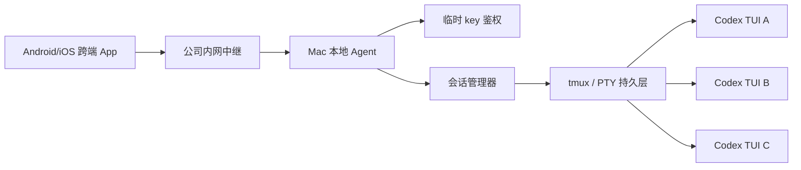
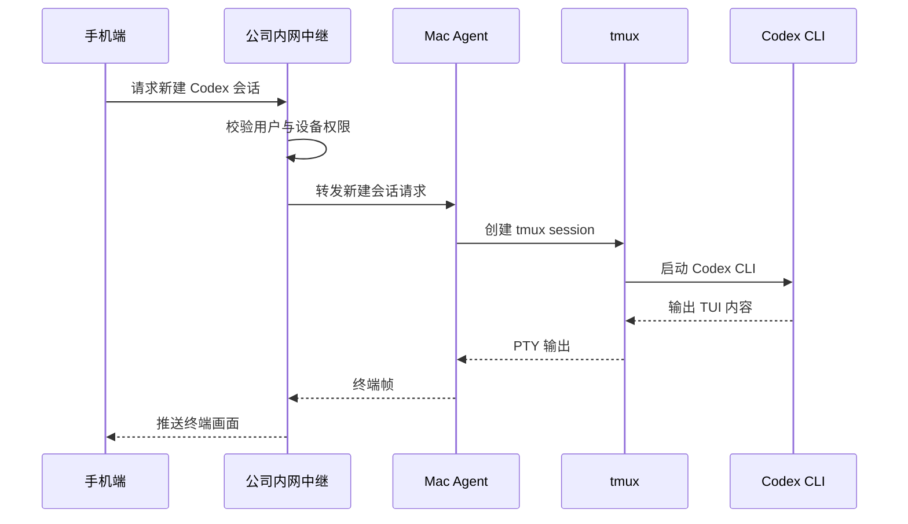
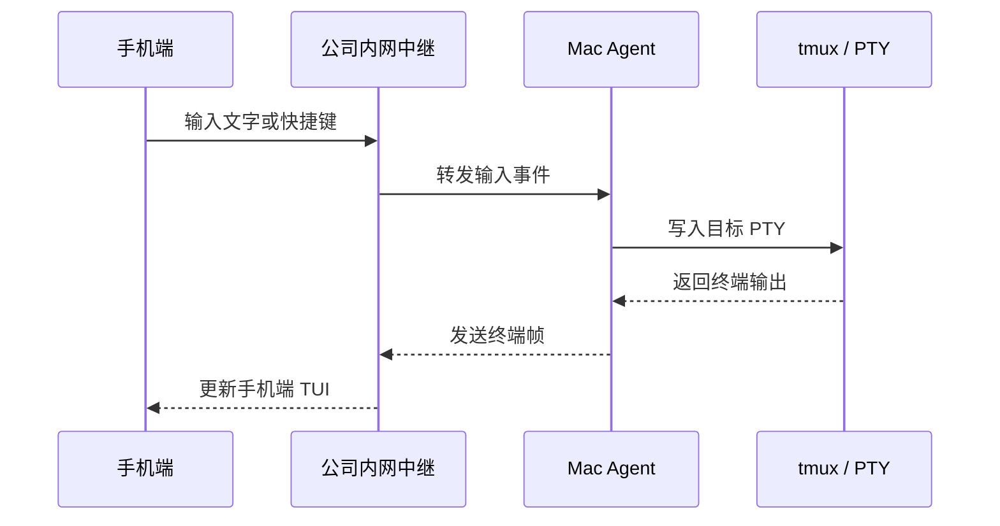
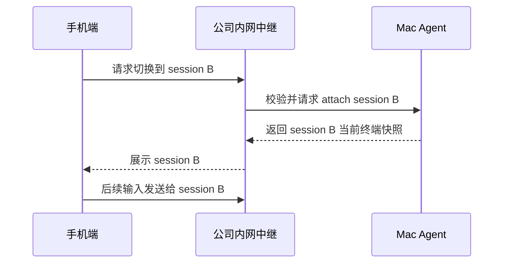

# 手机端 Codex TUI 工作台设计

关联工程要求：[engineering-requirements.md](./engineering-requirements.md)

关联鉴权设计：[auth-key-design.md](./auth-key-design.md)

## 当前 MVP 实装状态（2026-05-22）

本文档记录的是设计意图。当前已落地的 App 屏幕（[app/src/screens/](../app/src/screens/)）：

- [DeviceListScreen](../app/src/screens/devices/DeviceListScreen.tsx)：已保存设备列表与切换。
- [PairingScreen](../app/src/screens/pairing/PairingScreen.tsx) + `PairingQrScannerModal.{native,web}.tsx`：扫码 / URL / 32 字符 key 三种配对方式。
- [SessionListScreen](../app/src/screens/sessions/SessionListScreen.tsx)：按 workspace + provider 分组。
- [TerminalScreen](../app/src/screens/terminal/TerminalScreen.tsx)：原始 TUI 快照 + 输入。
- [FileBrowserScreen](../app/src/screens/workspaces/FileBrowserScreen.tsx) / [GitStatusScreen](../app/src/screens/workspaces/GitStatusScreen.tsx)：workspace 只读上下文。

下文中的页面、交互流转可能与现有 5 屏存在差异；以代码为准，本设计为后续演进的目标态参考。

## 背景

目标是在公司网络和公司统一管控的 Mac 电脑上，实现一种可以通过手机持续操作电脑端 Codex 命令行的办公能力。用户希望在手机上查看 Codex TUI 的运行结果、继续输入指令，并在多个 TUI 会话之间切换，从而支持长时间、异步、不中断的办公流程。

已知约束：

- 电脑是公司统一设备控制下的 Mac。
- 电脑端无法通过 SSH 被另一台电脑控制。
- 电脑端无法使用共享屏幕。
- 系统运行在公司网络和公司电脑上。
- 方案需要避免变成通用远程控制工具。

因此，本方案不设计为远程桌面或 SSH 替代品，而设计为公司合规边界内的「Mac 本地 Codex TUI 网关」。

## 设计目标

MVP 需要做到：

- 手机可以连接到自己的公司 Mac。
- 手机可以打开一个 Codex 命令行 TUI。
- 手机可以查看 TUI 输出。
- 手机可以向 TUI 输入文字和常用控制键。
- 手机可以创建、查看、切换多个 Codex TUI 会话。
- 手机断线、锁屏或切后台后，Mac 上的 Codex 会话继续运行。
- 手机重新连接后，可以恢复查看和交互。
- 整个系统不依赖 SSH、屏幕共享或远程桌面。

长期目标：

- 支持 24 小时办公：长任务持续运行、手机随时查看和接手。
- 当前阶段支持临时 key 鉴权、审计和失败限流；企业身份和设备绑定作为后续演进。
- 支持更好的移动端输入、通知和会话状态摘要。

## 非目标

第一阶段不做：

- 通用远程桌面。
- 鼠标、键盘级别的整机远控。
- 屏幕录制或屏幕共享。
- 公网端口暴露。
- 私有外网穿透。
- 任意命令执行平台。
- 多人协作编辑。
- 文件管理器或完整 IDE。
- 用 Codex API 替代 Codex CLI。

## 产品定位

产品的核心不是「手机控制电脑」，而是：

> 手机连接 Mac 本地 Agent，远程查看和操作由该 Agent 管理的 Codex TUI 会话。

Mac 端负责运行和持久化会话，手机端负责展示、输入和切换。手机断开不会影响 Mac 上已有的会话。

## 推荐架构

正式环境推荐采用「TypeScript Mac 本地 Agent + 公司内网中继 + Android/iOS 跨端移动 App」。



### 为什么需要公司内网中继

只做局域网直连会遇到企业网络常见限制：

- 手机和 Mac 可能不在同一可互访网段。
- 公司 Wi-Fi 可能启用客户端隔离。
- Mac 入站端口可能被防火墙或管控策略限制。
- 手机访问办公电脑的端口可能不符合安全策略。

中继模式更适合公司环境：

- Mac Agent 主动向公司内网中继建立出站连接。
- 手机也连接公司内网中继。
- 中继只转发经过授权的 TUI 流量。
- Mac 不需要开放入站端口。
- 不需要 SSH。
- 不需要屏幕共享。
- 可以统一做临时 key 鉴权、失败限流、连接审计和后续策略扩展。

局域网直连可以作为开发或小范围验证模式，但不应作为企业正式方案的唯一依赖。

## 组件设计

### 手机端

已确认手机端采用跨端移动 App 技术，同时适配 Android 和 iOS。

推荐方向：

- React Native CLI + TypeScript。
- 原始 TUI 快照通过 React Native 原生组件渲染。
- 结构化 Codex UI 使用 React Native 原生组件。
- 通知走 APNs / FCM 或公司统一推送网关。
- 最终交付 APK / IPA 安装包，不以网页或 PWA 作为交付形态。
- 所有包含输入框的移动端页面必须处理软键盘避让，并支持滚动或点击输入框外区域收起键盘，避免临时 key、工作目录、终端输入栏等底部输入区被遮挡。

主要页面：

- 登录 / 配对页
  - 输入或扫码 Mac Agent 当前启动生成的 32 字符临时 key。
  - 选择目标 Mac。
  - 为当前链接设备选择连接方式：WebSocket Relay 或 WebRTC。
  - Mac Agent 重启后需要重新输入新 key。

- 设备页
  - 展示当前可连接的 Mac。
  - 展示在线、离线、最近连接时间。
  - 展示当前设备使用的连接方式，并允许进入编辑页调整。

- 会话列表页
  - 展示多个 Codex TUI 会话。
  - 显示名称、目录、状态、最近活动时间。
  - 支持新建、进入、重命名、关闭会话。

- TUI 交互页
  - 主区域渲染终端画面。
  - 底部输入栏。
  - 快捷键栏：`Esc`、`Tab`、方向键、`Ctrl+C`、`Ctrl+D`、回车。
  - 会话切换入口。
  - 横屏优化。
  - 复制、粘贴、选择文本。

### Mac 本地 Agent

Mac Agent 是用户态程序，运行在用户自己的公司 Mac 上。

职责：

- 管理 Codex TUI 会话。
- 创建和恢复 `tmux` session。
- 将 PTY 输出转成终端帧，推送到手机。
- 接收手机输入事件，写入对应 PTY。
- 维护会话元数据。
- 与公司内网中继建立出站长连接。
- 执行鉴权、访问控制和审计上报。

它不做：

- 不读取整机屏幕。
- 不控制鼠标。
- 不接管系统键盘。
- 不暴露任意 shell 给未授权客户端。
- 不绕过公司设备管控。

### 公司内网中继

中继服务是手机和 Mac Agent 之间的连接枢纽。

职责：

- 转发临时 key challenge/proof。
- 接收 Mac Agent 的 `agent.hello`，记录 `device_id`、`agent_instance_id`、`key_id`。
- 让 Mac Agent 校验 App 的 key proof。
- 接收 Mac Agent 的出站注册连接。
- 在手机和 Mac Agent 之间转发 TUI 数据。
- 记录连接、断开、会话创建、会话关闭等审计事件。
- 做认证失败限流和异常连接保护。

中继不需要理解 Codex 业务语义，第一版可以只作为安全转发层。

### 会话持久层

推荐用 `tmux` 管理 Codex TUI 生命周期。

每个 Codex TUI 对应一个独立的 `tmux` session 或 window。Mac Agent 只负责创建、attach、detach、列出和关闭。

优势：

- 手机断开不会杀掉 Codex。
- Mac Agent 重启后可以重新发现已有会话。
- Codex 长任务可以持续运行。
- 多个 TUI 可以天然隔离。

会话元数据建议包含：

```text
session_id
title
cwd
command
status
created_at
last_active_at
terminal_size
tmux_session_name
owner_user_id
mac_device_id
```

## 数据流

### 创建会话



### 操作会话



### 切换会话



## 终端交互设计

手机上的 TUI 交互是最大体验风险之一。

第一版建议采用：

- 固定终端宽度，例如 `100x32` 或 `120x36`。
- 手机上支持缩放和横向拖动。
- 横屏时展示更完整的终端宽度。
- 输入栏固定在底部。
- 常用控制键做成按钮。

不建议第一版强行将 TUI 压缩到手机屏幕宽度，因为 Codex TUI 可能出现布局错乱、换行异常和信息密度过低的问题。

后续可以增加移动优化能力：

- 最新输出摘要。
- 当前任务状态提取。
- 重要结果高亮。
- 常用 prompt 模板。
- 任务完成通知。

## 安全与合规

由于本系统可以间接操作公司 Mac 上的命令行，安全边界必须明确。

最低要求：

- 当前阶段不接入 SSO。
- Mac Agent 每次启动生成 32 字符临时 key。
- App 使用该 key 完成本次连接授权。
- WebSocket 全链路 TLS。
- Relay 不保存完整 key。
- Mac Agent 重启后旧 key 自动失效。
- 长时间未操作自动锁定。
- 认证失败需要限流。
- 审计连接、断开、新建会话、关闭会话、切换会话。
- 默认不记录完整终端内容，除非公司安全策略明确要求。
- Mac Agent 只允许管理自己创建或明确登记的 Codex/tmux 会话。

建议默认策略：

- 不开放公网端口。
- 不提供任意远程 shell 入口。
- 不支持跨用户访问其他人的 Mac。
- 不保存明文长期凭证。
- 不绕过公司代理、VPN、防火墙或 MDM 策略。

## 24 小时办公设计

24 小时办公能力主要依赖 Mac 端持续运行，而不是手机持续在线。

需要保证：

- Codex TUI 运行在 Mac 上的 `tmux` 中。
- 手机断开不会影响会话。
- Mac Agent 断开中继后可以自动重连。
- Mac Agent 重启后可以恢复会话索引。
- 中继断开后不杀掉本地会话。
- 手机重连后能拿到终端快照。
- 会话列表能显示最近活动和运行状态。

后续增强：

- 任务完成后推送通知。
- 长时间无输出时显示心跳状态。
- 会话异常退出时保留退出码和最后输出。
- 对长任务增加「关注」和「提醒我」能力。

## 网络模式

### 开发模式：局域网直连

用于早期验证：

- Mac Agent 在本机监听局域网地址。
- 手机直接访问 Mac 的 IP 和端口。
- 使用 32 字符临时 key 鉴权。

风险：

- 可能被公司网络隔离阻断。
- 入站端口可能不被允许。
- 不适合作为企业正式默认方案。

### 正式模式：公司内网中继

用于企业部署：

- Mac Agent 主动连接中继。
- 手机连接中继。
- 中继完成临时 key proof 转发和连接路由。
- 所有访问可审计、可撤销、可纳管。

这是推荐的正式架构。

## MVP 验收标准

第一版完成的判断标准：

- Mac Agent 可以启动。
- Mac Agent 可以创建至少一个 Codex TUI 会话。
- 手机端可以通过公司内网中继连接自己的 Mac。
- 手机端可以看到 Codex TUI 输出。
- 手机端可以发送文字、回车、方向键、`Esc`、`Tab`、`Ctrl+C`。
- 支持至少 3 个 Codex TUI 会话。
- 手机端可以在多个 TUI 会话之间切换。
- 手机断开 10 分钟后重新连接，原 TUI 会话仍然存在。
- Mac Agent 重启后，已有 `tmux` 会话可以重新发现。
- 中继记录连接、断开、新建会话和关闭会话审计事件。
- 不使用 SSH。
- 不使用屏幕共享。
- 不开放公网端口。

## 主要风险

- 公司网络是否允许手机访问内网中继。
- Mac 是否允许安装或运行常驻用户态 Agent。
- Mac Agent 的出站 WebSocket 是否会被代理或安全网关中断。
- 公司 MDM 是否限制自启动、后台常驻或本地证书。
- 手机浏览器在锁屏或切后台后会暂停 WebSocket。
- 移动端 TUI 输入体验可能需要多轮打磨。
- Codex TUI 在窄屏和缩放场景下可能有布局兼容问题。

## 待确认问题

- 公司手机是否在同一企业网络或 VPN 下。
- 是否已有公司内网中继、网关或统一接入平台可以复用。
- 临时 key 展示方式：手动复制、终端输出、Menu Bar 或二维码。
- 是否要求终端内容审计，还是只需要操作元数据审计。
- Mac Agent 是否可以通过 LaunchAgent 自启动。
- 是否允许安装 `tmux`，或公司 Mac 是否已内置。
- 是否有企业证书和内网域名可用于 TLS。
- 手机端跨端技术选择：React Native CLI 是否符合企业移动端基建要求。

## 推荐里程碑

### 阶段 1：本机能力验证

- Mac Agent 能创建 Codex TUI。
- `tmux` 会话能持久存在。
- 可以 attach、detach、恢复。

### 阶段 2：局域网验证

- 手机浏览器能连接 Mac Agent。
- 能查看一个 TUI。
- 能发送输入。

### 阶段 3：中继验证

- Mac Agent 主动连接公司内网中继。
- 手机通过中继连接 Mac。
- 完成临时 key 鉴权。

### 阶段 4：多会话

- 支持创建、列出、切换、关闭多个 Codex TUI。
- 支持会话标题和最近活动状态。

### 阶段 5：可靠性和安全

- 断线重连。
- Agent 重启恢复。
- 审计日志。
- 临时 key 失败限流和重启失效。
- 空闲锁定。

### 阶段 6：移动体验优化

- 横屏优化。
- 快捷键栏。
- 复制粘贴。
- 终端缩放。
- 任务完成通知。

## 结论

在公司受控 Mac 环境中，最合适的方案是：

> TypeScript Mac 本地 Agent 管理 Codex TUI，使用 `tmux` 保持多个会话，通过公司内网中继将授权后的终端流传给 Android/iOS 跨端移动 App。

这个方案避开了 SSH、屏幕共享和通用远程桌面，能力边界清晰，更容易进入企业安全审查；同时也能满足手机查看、输入、切换多个 Codex TUI，以及 24 小时持续办公的核心需求。
